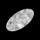

# cellgenerator

[](https://github.com/gwaybio/cellgenerator/actions/workflows/tests.yml)
[](https://github.com/gwaybio/cellgenerator/actions/workflows/lint.yml)

**cellgenerator** is a Python package for creating synthetic cell images to study how [CellProfiler](https://cellprofiler.org/) features respond to rotation.

CellProfiler features should ideally be **rotation-invariant** — a cell is the same cell regardless of how it sits in the image frame. In practice, some features are sensitive to rotation, which represents a measurement artefact rather than biology. This package generates controlled synthetic images to:

1. **Identify** which CellProfiler features change with rotation
2. **Correct** rotation-sensitive features where possible
3. **Blocklist** features in [pycytominer](https://github.com/cytomining/pycytominer) where correction is not feasible

> Originally authored by [Hugh Warden](https://github.com/hwarden162). Forked and substantially extended by [Gregory Way](https://github.com/gwaybio).

---

## Installation

```bash
pip install cellgenerator
```

Or for development:

```bash
git clone https://github.com/gwaybio/cellgenerator.git
cd cellgenerator
pip install -e ".[dev]"
```

---

## Quick start

```python
from cellgenerator import Image
from cellgenerator.mask import EllipseMask
from cellgenerator.stain import SpatialStain

# Define cell shape: an ellipse with semi-axes 200px (y) and 400px (x)
mask = EllipseMask(y_radius=200, x_radius=400)

# Define staining pattern: spatially correlated intensity variation
stain = SpatialStain(y_corr=20, x_corr=20)

# Compose the synthetic cell at high internal resolution
img = Image(dim=(1000, 1000), mask=mask, stain=stain)

# Render at output resolution with a 35° rotation
img.plot(dim=(80, 80), rotate=35)
img.save(path="example_images/cell.png", dim=(80, 80), rotate=35)
```



---

## Architecture

| Component | Role | Built-in classes |
|-----------|------|-----------------|
| **Mask** | Defines cell shape (boolean array) | `CircleMask`, `EllipseMask` |
| **Stain** | Defines intensity pattern inside cell | `ConstantStain`, `SpatialStain` |
| **Noise** | Multiplicative pixel-level perturbation | `ConstantNoise` |
| **Image** | Composes all three; renders at any rotation | — |

All three components are abstract base classes — extend them to add new cell shapes, staining models, or noise types.

### Rendering pipeline

```
mask (bool array)  ×  stain (normalised to [stain_min, stain_max])
        ↓
  apply noise  →  scale to uint8  →  rotate  →  resize  →  PIL Image
```

---

## Development

```bash
# Run tests
pytest

# Run tests with coverage
pytest --cov=cellgenerator --cov-report=term-missing

# Lint and format check
ruff check .
ruff format --check .

# Auto-fix formatting
ruff format .
```

---

## Roadmap

- [ ] Additional mask types (irregular/polygon cells)
- [ ] Additional stain types (radial gradient, multi-compartment)
- [ ] Additional noise types (Poisson, Gaussian)
- [ ] CellProfiler pipeline integration and batch image generation
- [ ] Rotation sensitivity analysis and feature flagging
- [ ] pycytominer blocklist generation

---

## Citation

If you use this software, please cite the original author:

> Hugh Warden. *cellgenerator*. https://github.com/hwarden162/cellgenerator

## License

MIT — see [LICENSE](LICENSE).
